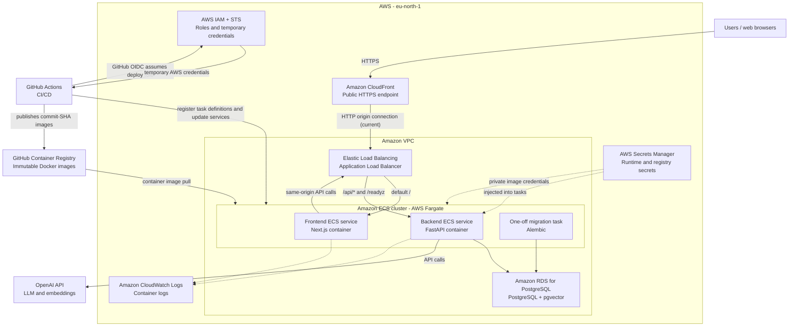

# FinSight-AI AWS Technology Inventory

This document summarizes the AWS services currently used by the FinSight-AI production environment. It is based on the repository configuration and deployment documentation as of **June 28, 2026**.

## Architecture at a glance

## AWS services currently in use

| AWS technology | How FinSight-AI uses it |
| --- | --- |
| **Amazon CloudFront** | Provides the public HTTPS endpoint and redirects viewers from HTTP to HTTPS. It forwards traffic to the ALB origin. |
| **Elastic Load Balancing - Application Load Balancer (ALB)** | Routes `/api/*` and `/readyz` to the backend target group; all other paths go to the frontend target group. |
| **Amazon Elastic Container Service (ECS)** | Runs separate frontend and backend services and stores their task definitions. The cluster is `busy-lion-6wzrd8`. |
| **AWS Fargate** | Supplies serverless compute for the ECS containers and for one-off backend database-migration tasks. |
| **Amazon RDS for PostgreSQL** | Hosts the production relational database. The application uses PostgreSQL and the `vector` extension for pgvector embeddings and similarity search. |
| **Amazon VPC** | Provides the network boundary for the ALB, ECS tasks, and RDS. The deployed ALB uses two subnets, and ECS uses `awsvpc` networking with subnets and security groups. |
| **AWS Secrets Manager** | Injects `DATABASE_URL`, `OPENAI_API_KEY`, `JWT_SECRET_KEY`, and `JWT_REFRESH_SECRET_KEY` into the backend task. It can also supply private GHCR pull credentials. |
| **Amazon CloudWatch Logs** | Receives frontend and backend container logs from ECS task definitions. |
| **AWS Identity and Access Management (IAM)** | Controls the GitHub deployment role, ECS task execution/task roles, `iam:PassRole`, and access to ECS and Secrets Manager. |
| **AWS Security Token Service (STS) / GitHub OIDC federation** | Lets GitHub Actions assume the deployment role with short-lived credentials instead of storing long-lived AWS access keys. |
| **AWS IAM Identity Center** | Provides human AWS CLI access through the `finsight-ai` SSO profile. |
| **AWS CLI** | Used by operators and the deployment workflow to inspect/register ECS task definitions, run migrations, update services, and wait for service stability. |

## Current deployed resources

| Resource | Current value |
| --- | --- |
| AWS Region | `eu-north-1` |
| CloudFront endpoint | `https://d3p7l0r823wgar.cloudfront.net` |
| Public ALB origin | `http://finsight-ai-alb-19805196.eu-north-1.elb.amazonaws.com` |
| ECS cluster | `busy-lion-6wzrd8` |
| Frontend ECS service | `finsight-ai-frontend-service-0pfkokpq` |
| Backend ECS service | `finsight-ai-backend-service-cet6tjci` |
| Frontend task family | `finsight-ai-frontend` |
| Backend task family | `finsight-ai-backend` |
| Frontend target group | `finsight-ai-frontend-tg` |
| Backend target group | `finsight-ai-backend-tg` |
| RDS engine/port | PostgreSQL on `5432` |
| Deployment IAM role | `FinSightGitHubActionsDeployRole` |

## How deployment works

1. GitHub Actions tests the Python and Node.js applications, builds both Docker images, and scans them with Trivy.
2. Successful `master` builds are published to GHCR with an immutable Git commit SHA tag.
3. The deployment workflow exchanges its GitHub OIDC token for temporary AWS credentials by assuming an IAM role.
4. It registers a new backend ECS task definition, runs `alembic upgrade head` as a one-off Fargate task, and updates the backend service.
5. It registers a new frontend ECS task definition and updates the frontend service.
6. ECS sends container logs to CloudWatch Logs, while the workflow waits for service stability and runs public smoke checks.

## Important current limitation

TLS currently ends at CloudFront. Browser-to-CloudFront traffic is encrypted, but CloudFront connects to the ALB over HTTP. Full end-to-end TLS is not yet active.

## Planned AWS services - not currently active

These technologies appear in the production roadmap but should not be described as part of the current deployed stack:

| Planned technology | Intended purpose |
| --- | --- |
| **Amazon S3** | Durable private storage for uploaded evidence files. Uploads currently use container-local storage. |
| **Amazon ElastiCache for Redis** | Managed Redis for distributed rate limiting and ARQ background jobs. Redis currently exists only in the local Docker Compose stack. |
| **AWS Certificate Manager (ACM)** | Certificate for HTTPS between CloudFront and the ALB. |
| **Amazon Route 53 / custom domain** | DNS and domain validation needed for end-to-end TLS. |
| **Additional ECS worker service** | Runs ARQ background jobs when asynchronous processing is enabled. |

## Related repository files

- [`README.md`](README.md) - project overview and production endpoint.
- [`docs/15-aws-cicd.md`](docs/15-aws-cicd.md) - detailed AWS setup, security posture, and operational notes.
- [`.github/workflows/deploy-aws.yml`](.github/workflows/deploy-aws.yml) - executable AWS deployment workflow.
- [`.github/workflows/ci.yml`](.github/workflows/ci.yml) - test, build, scan, and image-publishing pipeline.
