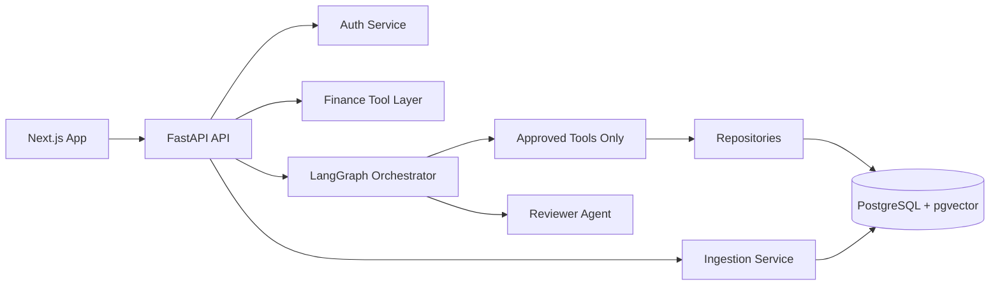

# 2. Architecture Review

## Supervisor Decision

Use a modular monorepo:

- `frontend`: Next.js 15 application.
- `backend`: FastAPI API, AI agents, services, repositories, tests.
- `infrastructure`: database bootstrap and Docker resources.
- `docs`: design, security, QA, and roadmap artifacts.

## Alternatives Considered

- Single full-stack Next.js app: faster to demo, weaker for Python OCR, LangGraph, and data workloads.
- Microservices from day one: more scalable on paper, unnecessary operational complexity for a portfolio system.
- Direct LLM SQL access: flexible, but rejected due to privacy, safety, and auditability concerns.

## Accepted Architecture

## Reviewer Validation

The architecture is maintainable because it keeps AI orchestration, financial domain logic, persistence, and HTTP transport separate. The main technical debt risk is breadth: production hardening should prioritize observability, data encryption, and institution-specific parsers before adding new user-visible features.
