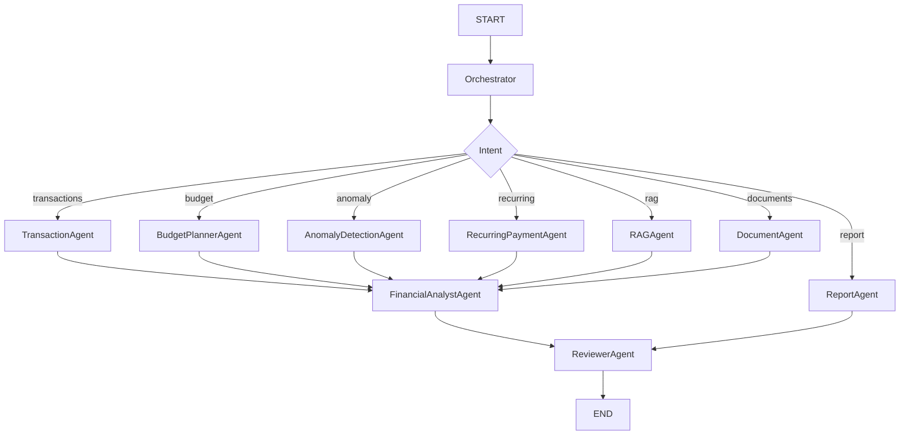

# 4. LangGraph Graph Design

## Graph

## Tool Policy

The LLM can request only these backend tools:

- `get_transactions`
- `get_monthly_summary`
- `compare_months`
- `get_spending_by_category`
- `detect_anomalies`
- `generate_budget`
- `get_top_merchants`
- `get_recurring_payments`

## Implementation Note

The backend exposes the graph through an adapter. In production, it can bind LangGraph nodes to OpenAI tool calls. In tests, deterministic node functions can run without external network calls.
